# BrightSpot API

API em .NET 8 para monitoramento ambiental contextual em ambientes extremos e de difícil acesso. O projeto modela um gadget chamado BrightSpot, capaz de registrar sensores, coletar leituras ambientais, gerar alertas, calcular risco operacional e manter rastreabilidade de sincronização offline.

## Integrantes

- 565065 - Augusto Barcelos Barros
- 556197 - Caio Felipe de Lima Bezerra
- 555541 - Juan Francisco Alves Muradas
- 555931 - Lucas Derenze Simidu
- 554873 - Sofia Fernandes

## Motivação e conexão com o tema

Missões espaciais, simulações de colonização lunar/marciana e operações em áreas isoladas dependem de telemetria confiável para reduzir risco humano. O BrightSpot representa uma API para apoiar esse tipo de operação: um dispositivo remoto coleta dados de temperatura, umidade, luminosidade, qualidade do ar e vibração, permitindo que equipes avaliem se um ambiente é seguro para exploração.

A proposta também se conecta aos ODS por apoiar tomada de decisão em ambientes de risco, monitoramento de áreas isoladas e prevenção de incidentes em operações remotas.

## Tecnologias

- .NET 8
- ASP.NET Core Web API
- Entity Framework Core
- Oracle Entity Framework Core
- Oracle Database FIAP
- Swagger / Swashbuckle
- Git e GitHub

## Principais recursos

- Cadastro e consulta de gadgets BrightSpot
- Configuração de modo de operação e thresholds ambientais
- Cadastro de sensores por dispositivo
- Registro de leituras ambientais com data/hora UTC
- Geração automática de alertas por threshold
- Cadastro manual e exclusão de alertas operacionais
- Avaliação de risco ambiental
- Sincronização de leituras coletadas offline
- Logs de sincronização
- Exclusão de dispositivos com histórico vinculado

## Estrutura do projeto

```text
GlobalSolution.SenseSpot.API/
|-- Controllers/
|   |-- DevicesController.cs
|   `-- ReadingsController.cs
|-- Data/
|   |-- AppDbContext.cs
|   `-- AppDbContextFactory.cs
|-- Middleware/
|   `-- ExceptionHandlingMiddleware.cs
|-- Models/
|   |-- Device.cs
|   |-- Sensor.cs
|   |-- SensorReading.cs
|   |-- Alert.cs
|   |-- RiskAssessment.cs
|   `-- SyncLog.cs
|-- Services/
|   |-- IAlertService.cs
|   |-- AlertService.cs
|   |-- IRiskAssessmentService.cs
|   `-- RiskAssessmentService.cs
|-- Migrations/
|-- docs/
`-- Program.cs
```

## Como executar

1. Configure a connection string do Oracle.

   Opção recomendada via variável de ambiente:

   ```powershell
   $env:ConnectionStrings__OracleConnection="User Id=SEU_RM;Password=SUA_SENHA;Data Source=oracle.fiap.com.br:1521/ORCL"
   ```

   Também é possível editar localmente o `appsettings.Development.json`. Senhas reais não devem ser publicadas no GitHub.

2. Restaure e compile o projeto:

   ```powershell
   dotnet restore
   dotnet build
   ```

3. Execute a API:

   ```powershell
   dotnet run
   ```

4. Abra o Swagger:

   ```text
   https://localhost:7107/swagger
   ```

   A porta pode variar conforme o `Properties/launchSettings.json`.

## Endpoints principais

| Método | Rota                                       | Finalidade                          |
| ------ | ------------------------------------------ | ----------------------------------- |
| POST   | `/api/devices`                             | Cadastra um gadget                  |
| GET    | `/api/devices`                             | Lista gadgets                       |
| GET    | `/api/devices/{id}`                        | Detalha um gadget                   |
| PATCH  | `/api/devices/{id}/status`                 | Atualiza status operacional         |
| PATCH  | `/api/devices/{id}/configuration`          | Atualiza thresholds e modo          |
| POST   | `/api/devices/{id}/sensors`                | Adiciona sensor                     |
| GET    | `/api/devices/{id}/sensors`                | Lista sensores                      |
| DELETE | `/api/devices/{id}`                        | Remove gadget e histórico vinculado |
| POST   | `/api/devices/{deviceId}/readings`         | Registra leitura ambiental          |
| GET    | `/api/devices/{deviceId}/readings`         | Lista leituras                      |
| POST   | `/api/devices/{deviceId}/alerts`           | Cadastra alerta manual              |
| GET    | `/api/devices/{deviceId}/alerts`           | Lista alertas                       |
| DELETE | `/api/devices/{deviceId}/alerts/{alertId}` | Remove alerta                       |
| GET    | `/api/devices/{deviceId}/risk-assessment`  | Consulta risco mais recente         |
| POST   | `/api/devices/{deviceId}/sync`             | Sincroniza leituras offline         |
| GET    | `/api/devices/{deviceId}/sync-logs`        | Lista logs de sincronização         |

## POO, abstração e regras de domínio

- `BaseEntity` concentra propriedades comuns de auditoria.
- `Sensor` é uma classe abstrata para os sensores do gadget.
- `TemperatureSensor`, `HumiditySensor`, `LuminositySensor`, `AirQualitySensor` e `VibrationSensor` especializam sensores com tipo e unidade.
- `IAlertService` e `IRiskAssessmentService` separam as regras de alerta e risco dos controllers.
- `Device.RegisterReading`, `Device.UpdateStatus` e `SensorReading.MarkAsSynced` encapsulam comportamentos de domínio.
- `DateTime.UtcNow`, `RecordedAtUtc`, `ReceivedAtUtc`, `TriggeredAtUtc`, `AssessedAtUtc` e `OccurredAtUtc` registram histórico temporal.

## Tratamento de exceções

A API possui `ExceptionHandlingMiddleware` para responder de forma controlada a:

- `DbUpdateException`: falhas de persistência no banco
- `FormatException`: dados em formato inválido
- `InvalidOperationException`: operações inválidas conhecidas
- `Exception`: falhas inesperadas com log informativo

## Diagramas e evidências

- Diagrama do projeto: [docs/architecture.md](docs/architecture.md)
- Diagrama em PlantUML: [docs/architecture.puml](docs/architecture.puml)
- Diagrama exportado em imagem: [docs/architecture.png](docs/architecture.png)
- Roteiro de evidências: [docs/evidencias.md](docs/evidencias.md)

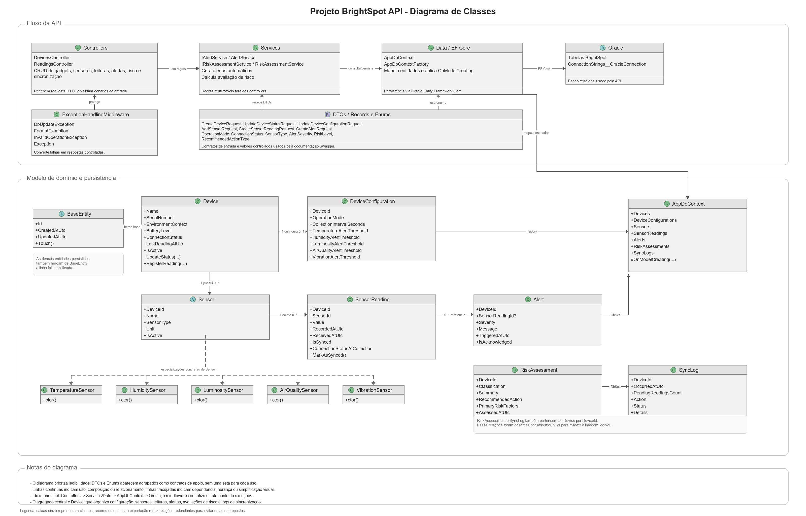

O diagrama de classes representa a organização principal da BrightSpot API. A parte superior mostra o fluxo da aplicação, com controllers ASP.NET Core, serviços de domínio, Entity Framework Core, Oracle, DTOs/enums e middleware de exceções. A parte inferior mostra o modelo de domínio e persistência, com `Device` como agregado central, sua configuração, sensores, leituras ambientais, alertas, avaliações de risco e logs de sincronização.

Para preservar a legibilidade, algumas relações repetitivas foram simplificadas visualmente. As entidades persistidas compartilham a herança de `BaseEntity`, enquanto `RiskAssessment` e `SyncLog` aparecem ligados ao dispositivo por `DeviceId` e pelos `DbSet` do `AppDbContext`. A versão isolada e comentada do diagrama está em [docs/architecture.md](docs/architecture.md).

## Demonstração em vídeo

Assista à demonstração completa da solução no YouTube:

[](https://www.youtube.com/watch?v=ApTJmqarkH8)

Link direto: [https://www.youtube.com/watch?v=ApTJmqarkH8](https://www.youtube.com/watch?v=ApTJmqarkH8)

## Evidências completas da execução

Esta seção consolida as evidências diretamente no README, mantendo também uma versão isolada em [docs/evidencias.md](docs/evidencias.md) para organização dos prints e leitura independente.

Além das evidências em imagem e responses documentadas abaixo, foi gravado um vídeo demonstrando a solução funcionando. O vídeo apresenta o fluxo completo da API em execução:

**Vídeo de demonstração da BrightSpot API:** [https://www.youtube.com/watch?v=ApTJmqarkH8](https://www.youtube.com/watch?v=ApTJmqarkH8)

# Evidências de execução da BrightSpot API

Este documento reúne as evidências capturadas no Swagger e no terminal para demonstrar o funcionamento da API BrightSpot. As imagens e responses estão na pasta [`docs/evidencias`](docs/evidencias).

## Visão geral

As evidências cobrem:

- Execução da API com `dotnet run`.
- Configuração local da connection string Oracle.
- Swagger aberto e documentado.
- Fluxo de CRUD de dispositivos.
- Cadastro e consulta de sensores.
- Registro e consulta de leituras ambientais.
- Avaliação de risco.
- Cadastro, consulta e exclusão de alertas.
- Sincronização e consulta de logs.
- Remoção de dispositivo.

## Evidências de ambiente

### Connection string Oracle configurada

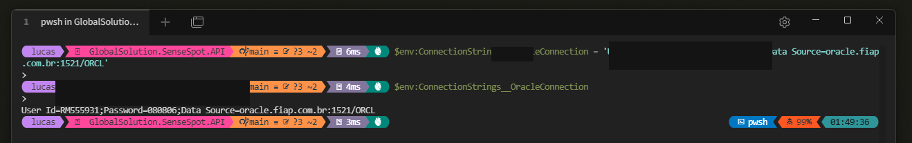

Esta evidência mostra a configuração local da variável de ambiente `ConnectionStrings__OracleConnection`, usada para não publicar senha real no GitHub.

Possíveis resultados diferentes:

- Se a senha, usuário ou conta Oracle estiverem incorretos, a API pode registrar `ORA-01017: invalid username/password`.
- Se a variável não for definida no mesmo terminal do `dotnet run`, a API usará o valor do `appsettings`, que contém placeholders.

Tratamento de erro relacionado:

- A inicialização captura falhas de migration e mantém a API ativa, registrando warning no log.
- O `ExceptionHandlingMiddleware` trata falhas de banco durante requests com resposta controlada.

### API executando com `dotnet run`

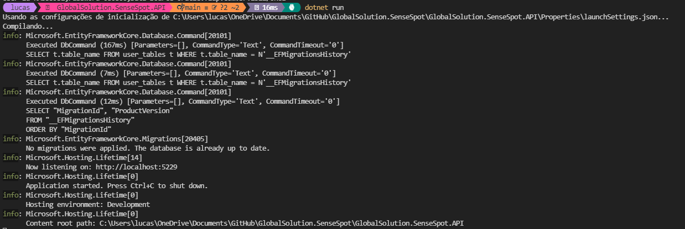

Esta evidência mostra a aplicação iniciada em ambiente `Development`, com banco atualizado e porta HTTP ativa em `http://localhost:5229`.

Possíveis resultados diferentes:

- A porta pode variar conforme o `launchSettings.json`.
- Se a migration não puder ser aplicada, o terminal exibe warning, mas a API continua aberta.
- Se outro processo estiver usando a porta, o `dotnet run` pode falhar ao iniciar o host.

Tratamento de erro relacionado:

- Falhas de migration são capturadas no startup.
- Falhas inesperadas em requests são convertidas para `application/problem+json`.

### Swagger aberto

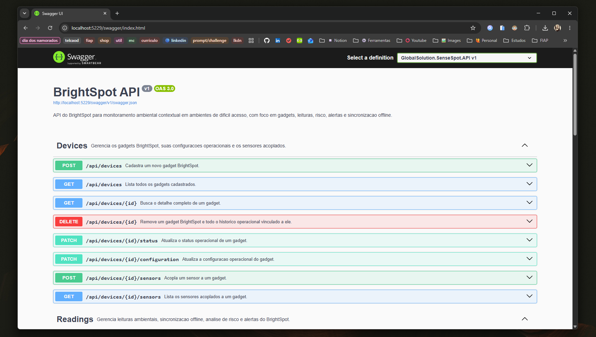

Esta evidência mostra o Swagger carregado, com os grupos `Devices` e `Readings`, rotas padronizadas em `/api/devices` e descrições XML dos endpoints.

Possíveis resultados diferentes:

- Em produção, o Swagger pode não aparecer se a aplicação não estiver em ambiente `Development`.
- Se a API não estiver rodando, o navegador retornará erro de conexão.

## Evidências de endpoints

### POST `/api/devices`

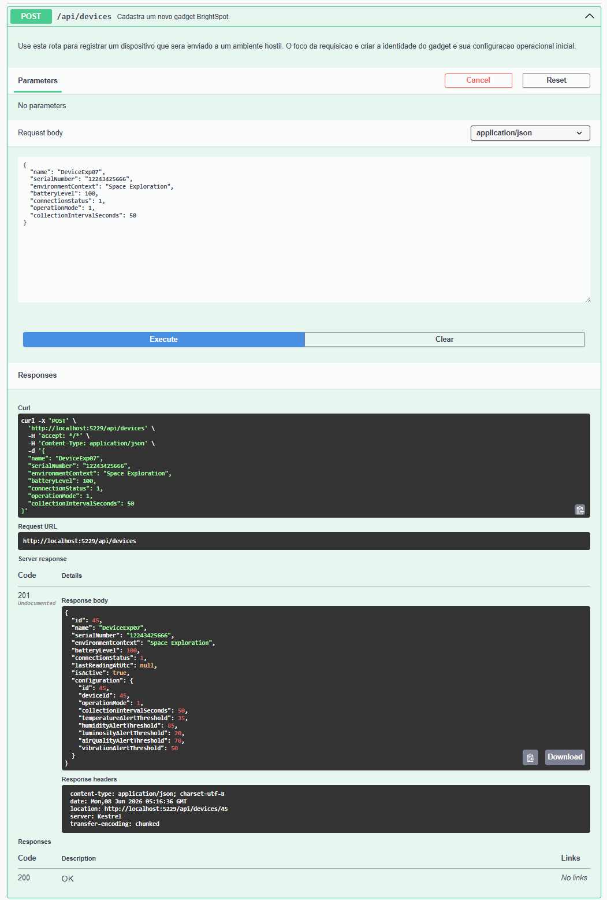

Response capturada (`response_post_api-devices.txt`):

```json
{
  "id": 45,
  "name": "DeviceExp07",
  "serialNumber": "12243425666",
  "environmentContext": "Space Exploration",
  "batteryLevel": 100,
  "connectionStatus": 1,
  "lastReadingAtUtc": null,
  "isActive": true,
  "configuration": {
    "id": 45,
    "deviceId": 45,
    "operationMode": 1,
    "collectionIntervalSeconds": 50,
    "temperatureAlertThreshold": 35,
    "humidityAlertThreshold": 85,
    "luminosityAlertThreshold": 20,
    "airQualityAlertThreshold": 70,
    "vibrationAlertThreshold": 50
  }
}
```

Contexto:

Este endpoint cadastra um novo gadget BrightSpot com nome, número serial, contexto ambiental, bateria, status de conexão, modo de operação e intervalo de coleta.

O que a evidência comprova:

- Criação de entidade principal do domínio.
- Persistência Oracle via Entity Framework.
- Criação automática da configuração inicial do dispositivo.
- Retorno `201 Created` com `id`, dados operacionais e thresholds padrão.

Responses possíveis:

- `201 Created`: dispositivo cadastrado.
- `400 Bad Request`: `collectionIntervalSeconds` menor ou igual a zero.
- `409 Conflict`: já existe dispositivo com o mesmo `serialNumber`.
- `503 Service Unavailable`: falha de persistência no Oracle tratada pelo middleware.

Variações conforme input/cenário:

- Se `batteryLevel` for maior que `100`, a API salva `batteryLevel` como `100`.
- Se `batteryLevel` for menor que `0`, a API salva `batteryLevel` como `0`.
- Se `serialNumber` já existir, o corpo da resposta será a mensagem `A device with this serial number already exists.`.
- Se `collectionIntervalSeconds` for `0` ou negativo, o corpo será `Collection interval must be greater than zero.`.
- Se `connectionStatus` mudar, o retorno refletirá o enum enviado: `1 = Online`, `2 = Offline`, `3 = Intermittent`.
- A configuração inicial sempre nasce com thresholds padrão quando o device é criado.

Tratamentos de erro:

- Validação de intervalo de coleta.
- Validação de serial duplicado.
- Middleware para falhas de banco.

### GET `/api/devices`

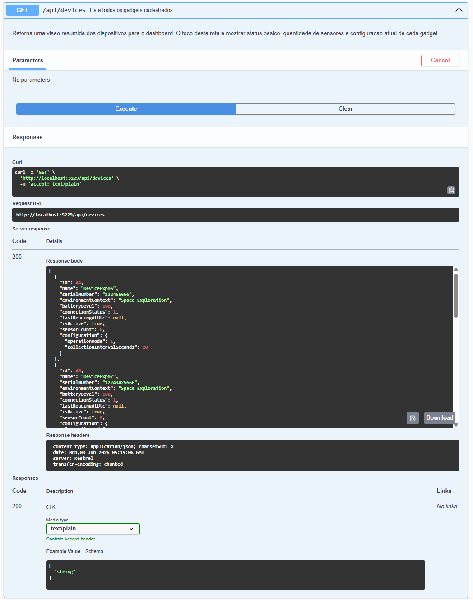

Response capturada (`response_get_api-devices.txt`):

```json
[
  {
    "id": 44,
    "name": "DeviceExp06",
    "serialNumber": "122455666",
    "environmentContext": "Space Exploration",
    "batteryLevel": 100,
    "connectionStatus": 1,
    "lastReadingAtUtc": null,
    "isActive": true,
    "sensorCount": 0,
    "configuration": {
      "operationMode": 1,
      "collectionIntervalSeconds": 20
    }
  },
  {
    "id": 45,
    "name": "DeviceExp07",
    "serialNumber": "12243425666",
    "environmentContext": "Space Exploration",
    "batteryLevel": 100,
    "connectionStatus": 1,
    "lastReadingAtUtc": null,
    "isActive": true,
    "sensorCount": 0,
    "configuration": {
      "operationMode": 1,
      "collectionIntervalSeconds": 50
    }
  },
  {
    "id": 1,
    "name": "ExplorationDevice-01",
    "serialNumber": "00001",
    "environmentContext": "Cave",
    "batteryLevel": 100,
    "connectionStatus": 1,
    "lastReadingAtUtc": null,
    "isActive": true,
    "sensorCount": 0,
    "configuration": {
      "operationMode": 1,
      "collectionIntervalSeconds": 10
    }
  },
  {
    "id": 22,
    "name": "ExplorationDevice-03",
    "serialNumber": "203453",
    "environmentContext": "Space Exploration",
    "batteryLevel": 70,
    "connectionStatus": 1,
    "lastReadingAtUtc": null,
    "isActive": true,
    "sensorCount": 0,
    "configuration": {
      "operationMode": 1,
      "collectionIntervalSeconds": 200
    }
  },
  {
    "id": 41,
    "name": "ExplorationDevice-04",
    "serialNumber": "12345678",
    "environmentContext": "Space Exploration",
    "batteryLevel": 20,
    "connectionStatus": 1,
    "lastReadingAtUtc": "2026-06-08T05:08:00.629",
    "isActive": false,
    "sensorCount": 2,
    "configuration": {
      "operationMode": 2,
      "collectionIntervalSeconds": 50
    }
  },
  {
    "id": 2,
    "name": "string",
    "serialNumber": "string",
    "environmentContext": "string",
    "batteryLevel": 90,
    "connectionStatus": 1,
    "lastReadingAtUtc": "2026-06-04T07:58:24.093",
    "isActive": true,
    "sensorCount": 1,
    "configuration": {
      "operationMode": 1,
      "collectionIntervalSeconds": 2
    }
  }
]
```

Contexto:

Este endpoint lista os gadgets cadastrados, mostrando dados resumidos, status, última leitura, quantidade de sensores e configuração básica.

O que a evidência comprova:

- Consulta agregada de dispositivos.
- Retorno de múltiplos registros persistidos.
- Exibição de `sensorCount`, `lastReadingAtUtc` e configuração resumida.

Responses possíveis:

- `200 OK`: lista de dispositivos, podendo ser vazia.
- `503 Service Unavailable`: banco indisponível durante a consulta.

Variações conforme input/cenário:

- Se não houver dispositivos cadastrados, o retorno será `[]`.
- Se um device ainda não tiver leituras, `lastReadingAtUtc` aparece como `null`.
- Se sensores forem adicionados ao device, `sensorCount` aumenta.
- Se o status ou a configuração forem alterados, os campos retornados refletem o último estado persistido.

Tratamentos de erro:

- Falhas inesperadas de banco são capturadas pelo middleware.

### GET `/api/devices/{id}`

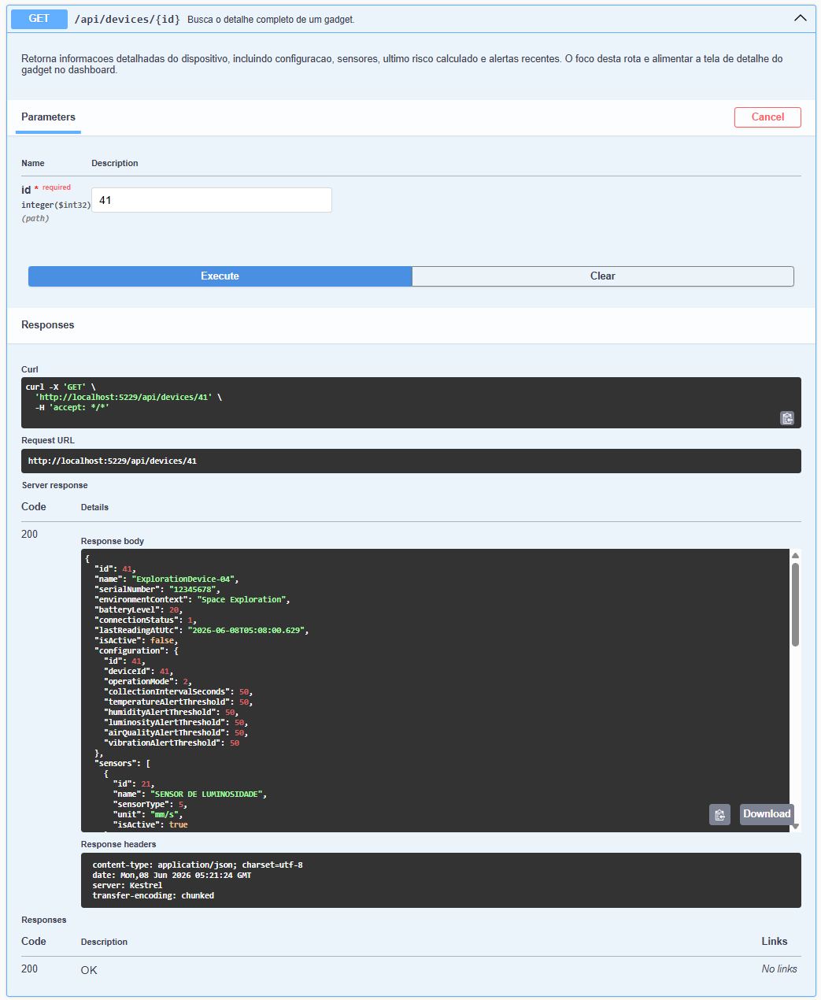

Response capturada (`response_get_api-devices-id.txt`):

```json
{
  "id": 41,
  "name": "ExplorationDevice-04",
  "serialNumber": "12345678",
  "environmentContext": "Space Exploration",
  "batteryLevel": 20,
  "connectionStatus": 1,
  "lastReadingAtUtc": "2026-06-08T05:08:00.629",
  "isActive": false,
  "configuration": {
    "id": 41,
    "deviceId": 41,
    "operationMode": 2,
    "collectionIntervalSeconds": 50,
    "temperatureAlertThreshold": 50,
    "humidityAlertThreshold": 50,
    "luminosityAlertThreshold": 50,
    "airQualityAlertThreshold": 50,
    "vibrationAlertThreshold": 50
  },
  "sensors": [
    {
      "id": 21,
      "name": "SENSOR DE LUMINOSIDADE",
      "sensorType": 5,
      "unit": "mm/s",
      "isActive": true
    },
    {
      "id": 22,
      "name": "SENSOR DE TEMPERATURA",
      "sensorType": 4,
      "unit": "aqi",
      "isActive": true
    }
  ],
  "latestRiskAssessment": {
    "id": 23,
    "deviceId": 41,
    "classification": 3,
    "summary": "Critical environment detected due to air quality.",
    "recommendedAction": "Avoid human entry and maintain remote operation.",
    "primaryRiskFactors": "air quality",
    "assessedAtUtc": "2026-06-08T05:08:29.1735642"
  },
  "recentAlerts": [
    {
      "id": 24,
      "deviceId": 41,
      "sensorReadingId": 22,
      "severity": 1,
      "message": "ALTA TEMPERATURA",
      "triggeredAtUtc": "2026-06-08T05:09:39.399",
      "isAcknowledged": false
    },
    {
      "id": 23,
      "deviceId": 41,
      "sensorReadingId": 23,
      "severity": 3,
      "message": "AirQuality reached a critical threshold with value 100 aqi.",
      "triggeredAtUtc": "2026-06-08T05:08:29.0822629",
      "isAcknowledged": false
    },
    {
      "id": 22,
      "deviceId": 41,
      "sensorReadingId": 21,
      "severity": 1,
      "message": "ALTA TEMPERATURA",
      "triggeredAtUtc": "2026-06-08T04:55:45.133",
      "isAcknowledged": false
    },
    {
      "id": 21,
      "deviceId": 41,
      "sensorReadingId": 21,
      "severity": 3,
      "message": "Vibration reached a critical threshold with value 10 mm/s.",
      "triggeredAtUtc": "2026-06-08T04:54:28.6100602",
      "isAcknowledged": false
    }
  ]
}
```

Contexto:

Este endpoint consulta o detalhe completo de um gadget específico.

O que a evidência comprova:

- Consulta por identificador.
- Inclusão de configuração, sensores, último risco calculado e alertas recentes.
- Uso de relacionamentos entre entidades do domínio.

Responses possíveis:

- `200 OK`: dispositivo encontrado.
- `404 Not Found`: dispositivo inexistente.
- `503 Service Unavailable`: falha de banco.

Variações conforme input/cenário:

- Se o device não tiver sensores, o array `sensors` será vazio.
- Se ainda não houver avaliação de risco, `latestRiskAssessment` será `null`.
- Se não houver alertas recentes, `recentAlerts` será vazio.
- Se houver leituras e alertas, o detalhe consolida tudo em uma única resposta: configuração, sensores, risco e alertas.
- Se o `id` informado não existir, a resposta será `Device not found.`.

Tratamentos de erro:

- Retorno claro quando o dispositivo não existe.
- Middleware para falhas de persistência/consulta.

### PATCH `/api/devices/{id}/status`

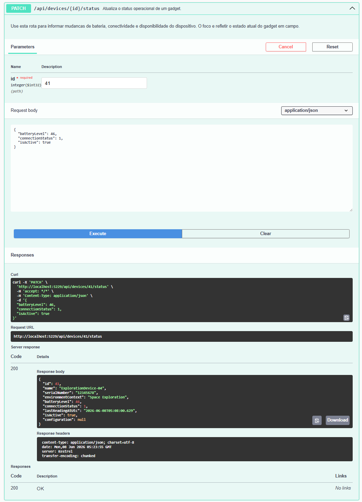

Response capturada (`response_patch_api-devices-id-status.txt`):

```json
{
  "id": 41,
  "name": "ExplorationDevice-04",
  "serialNumber": "12345678",
  "environmentContext": "Space Exploration",
  "batteryLevel": 46,
  "connectionStatus": 1,
  "lastReadingAtUtc": "2026-06-08T05:08:00.629",
  "isActive": true,
  "configuration": null
}
```

Contexto:

Este endpoint atualiza o estado operacional do gadget, como bateria, conectividade e flag de atividade.

O que a evidência comprova:

- Atualização parcial de estado.
- Uso do método de domínio `Device.UpdateStatus`.
- Controle de status operacional durante a missão.

Responses possíveis:

- `200 OK`: status atualizado.
- `404 Not Found`: dispositivo inexistente.
- `503 Service Unavailable`: falha de banco.

Variações conforme input/cenário:

- Se `batteryLevel` for maior que `100`, o retorno exibirá `100`.
- Se `batteryLevel` for menor que `0`, o retorno exibirá `0`.
- Se `isActive` for `false`, o device passa a aparecer como inativo.
- Se `connectionStatus` for `2`, o device passa a representar operação offline.
- Se o device não tiver configuração carregada no retorno resumido, `configuration` pode aparecer como `null`, sem significar que o update falhou.

Tratamentos de erro:

- Bateria é limitada internamente entre `0` e `100`.
- Dispositivo inexistente retorna mensagem clara.

### PATCH `/api/devices/{id}/configuration`

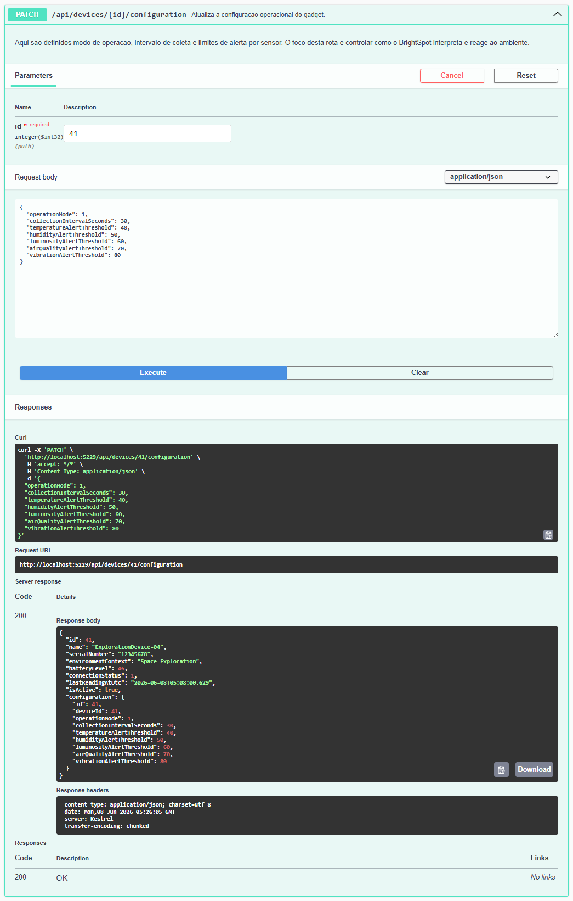

Response capturada (`response_patch_api-devices-id-configuration.txt`):

```json
{
  "id": 41,
  "name": "ExplorationDevice-04",
  "serialNumber": "12345678",
  "environmentContext": "Space Exploration",
  "batteryLevel": 46,
  "connectionStatus": 1,
  "lastReadingAtUtc": "2026-06-08T05:08:00.629",
  "isActive": true,
  "configuration": {
    "id": 41,
    "deviceId": 41,
    "operationMode": 1,
    "collectionIntervalSeconds": 30,
    "temperatureAlertThreshold": 40,
    "humidityAlertThreshold": 50,
    "luminosityAlertThreshold": 60,
    "airQualityAlertThreshold": 70,
    "vibrationAlertThreshold": 80
  }
}
```

Contexto:

Este endpoint atualiza modo de operação, intervalo de coleta e thresholds ambientais usados em alertas e avaliação de risco.

O que a evidência comprova:

- Configuração dinâmica do gadget.
- Atualização de thresholds de temperatura, umidade, luminosidade, qualidade do ar e vibração.
- Uso de dados configuráveis para regras de alerta e risco.

Responses possíveis:

- `200 OK`: configuração atualizada.
- `400 Bad Request`: intervalo de coleta menor ou igual a zero.
- `404 Not Found`: dispositivo inexistente.
- `503 Service Unavailable`: falha de banco.

Variações conforme input/cenário:

- Thresholds mais baixos tornam mais fácil gerar alertas automáticos e risco de atenção/crítico nas próximas leituras.
- Thresholds mais altos tornam mais difícil gerar alerta automático.
- Se `luminosityAlertThreshold` for aumentado, leituras de luminosidade abaixo ou iguais a esse valor passam a disparar atenção.
- Se `airQualityAlertThreshold` ou `vibrationAlertThreshold` forem baixos, leituras acima desses valores podem gerar risco `Critical`.
- Se `collectionIntervalSeconds` for `0` ou negativo, a API retorna `Collection interval must be greater than zero.`.

Tratamentos de erro:

- Validação explícita de `collectionIntervalSeconds`.
- Criação de configuração caso o dispositivo ainda não possua uma.

### POST `/api/devices/{id}/sensors`

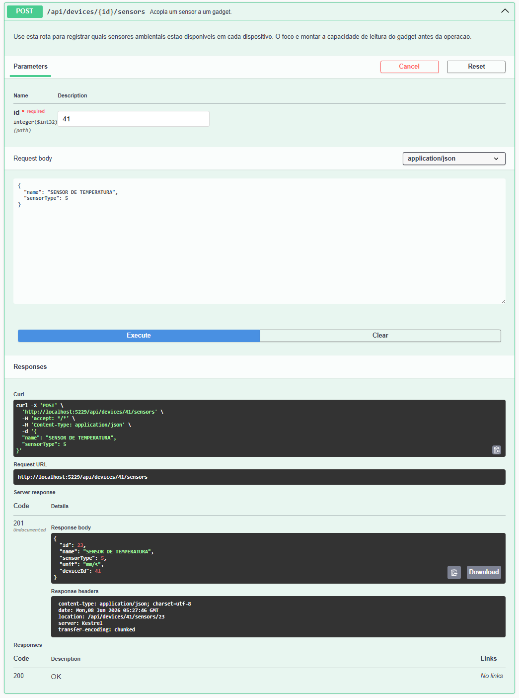

Response capturada (`response_post_api-devices-id-sensors.txt`):

```json
{
  "id": 23,
  "name": "SENSOR DE TEMPERATURA",
  "sensorType": 5,
  "unit": "mm/s",
  "deviceId": 41
}
```

Contexto:

Este endpoint acopla um sensor a um gadget existente.

O que a evidência comprova:

- Uso de herança e classe abstrata `Sensor`.
- Criação de sensores especializados conforme `sensorType`.
- Relacionamento entre `Device` e `Sensor`.

Responses possíveis:

- `201 Created`: sensor cadastrado.
- `400 Bad Request`: tipo de sensor não suportado.
- `404 Not Found`: dispositivo inexistente.
- `503 Service Unavailable`: falha de banco.

Variações conforme input/cenário:

- `sensorType: 1` cria sensor de temperatura, com unidade `celsius`.
- `sensorType: 2` cria sensor de umidade, com unidade `%`.
- `sensorType: 3` cria sensor de luminosidade, com unidade `lux`.
- `sensorType: 4` cria sensor de qualidade do ar, com unidade `aqi`.
- `sensorType: 5` cria sensor de vibração, com unidade `mm/s`.
- Se o `name` informado for diferente do tipo, a API aceita, mas a demonstração fica mais clara quando nome e tipo combinam.

Tratamentos de erro:

- `switch` de tipo de sensor cria apenas especializações conhecidas.
- Dispositivo inexistente é bloqueado antes da criação.

### GET `/api/devices/{id}/sensors`

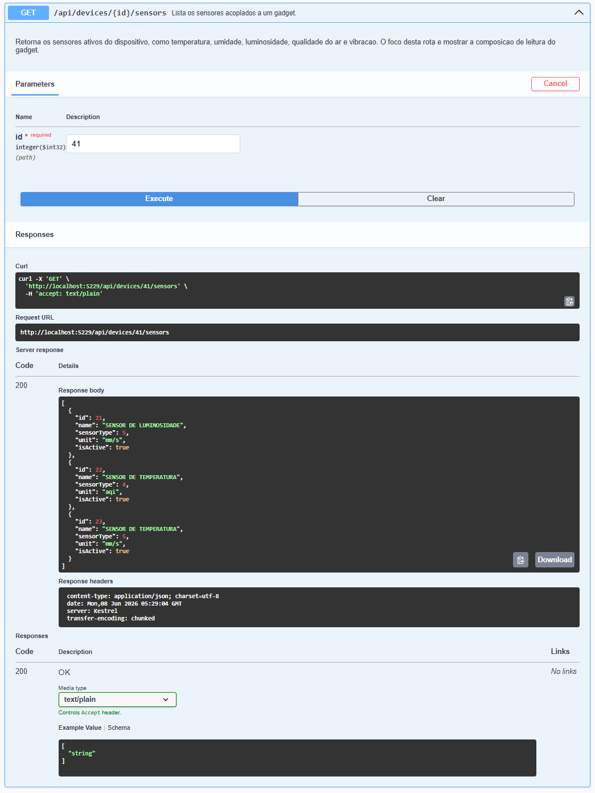

Response capturada (`response_get_api-devices-id-sensors.txt`):

```json
[
  {
    "id": 21,
    "name": "SENSOR DE LUMINOSIDADE",
    "sensorType": 5,
    "unit": "mm/s",
    "isActive": true
  },
  {
    "id": 22,
    "name": "SENSOR DE TEMPERATURA",
    "sensorType": 4,
    "unit": "aqi",
    "isActive": true
  },
  {
    "id": 23,
    "name": "SENSOR DE TEMPERATURA",
    "sensorType": 5,
    "unit": "mm/s",
    "isActive": true
  }
]
```

Contexto:

Este endpoint lista os sensores cadastrados em um gadget.

O que a evidência comprova:

- Consulta dos sensores vinculados ao dispositivo.
- Retorno de `sensorType`, unidade e status de atividade.

Responses possíveis:

- `200 OK`: lista de sensores, podendo ser vazia.
- `404 Not Found`: dispositivo inexistente.
- `503 Service Unavailable`: falha de banco.

Variações conforme input/cenário:

- Se nenhum sensor foi cadastrado para o device, o retorno será `[]`.
- Se sensores diferentes forem cadastrados, o array retorna cada um com seu `sensorType`, `unit` e `isActive`.
- Se o `id` do device não existir, a resposta será `Device not found.`.

Tratamentos de erro:

- A API valida se o dispositivo existe antes de consultar sensores.

### POST `/api/devices/{deviceId}/readings`

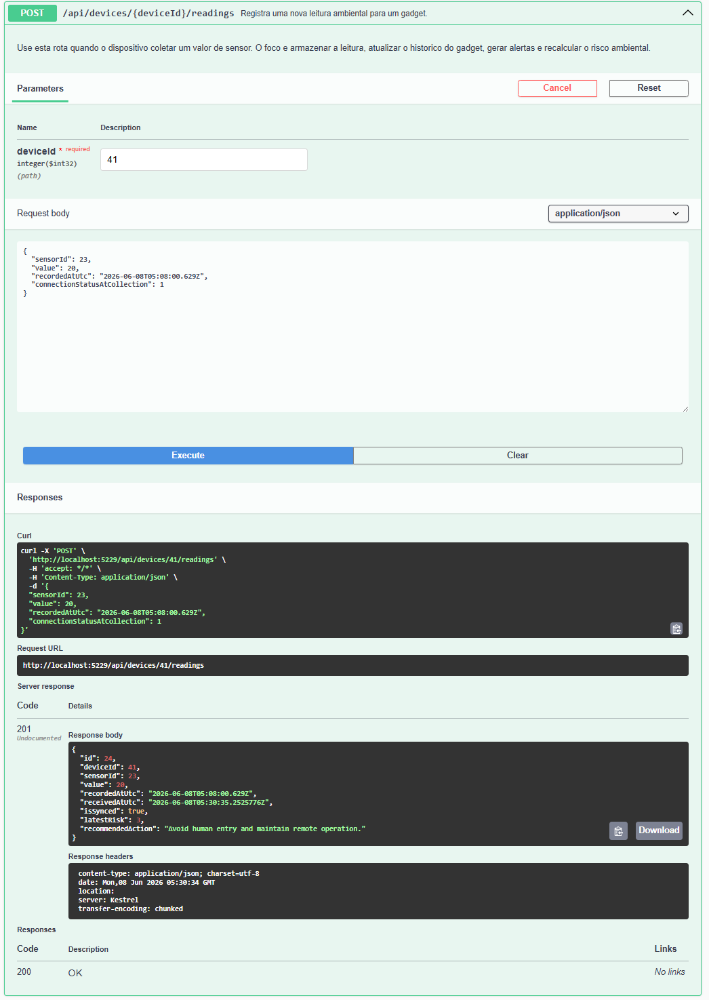

Response capturada (`response_post_api-devices-deviceid-readings.txt`):

```json
{
  "id": 24,
  "deviceId": 41,
  "sensorId": 23,
  "value": 20,
  "recordedAtUtc": "2026-06-08T05:08:00.629Z",
  "receivedAtUtc": "2026-06-08T05:30:35.2525776Z",
  "isSynced": true,
  "latestRisk": 3,
  "recommendedAction": "Avoid human entry and maintain remote operation."
}
```

Contexto:

Este endpoint registra uma leitura ambiental coletada por um sensor do gadget.

O que a evidência comprova:

- Persistência de leitura com `RecordedAtUtc` e `ReceivedAtUtc`.
- Atualização da última leitura do dispositivo.
- Cálculo de risco após a leitura.
- Geração automática de alerta quando thresholds são ultrapassados.
- Controle de sincronização quando a coleta ocorre offline.

Responses possíveis:

- `201 Created`: leitura registrada.
- `400 Bad Request`: `RecordedAtUtc` no futuro.
- `404 Not Found`: dispositivo inexistente.
- `404 Not Found`: sensor inexistente ou sensor não pertence ao dispositivo.
- `503 Service Unavailable`: falha de banco.

Variações conforme input/cenário:

- Se `connectionStatusAtCollection` for `1` ou `3`, a leitura retorna `isSynced: true`.
- Se `connectionStatusAtCollection` for `2`, a leitura retorna `isSynced: false` e cria log de sincronização pendente.
- Se o valor ultrapassar threshold de temperatura, umidade, qualidade do ar ou vibração, a API pode gerar alerta automático.
- Se o valor de luminosidade for menor ou igual ao threshold, a API pode gerar alerta automático de luminosidade.
- Se a leitura indicar risco crítico, `latestRisk` retorna `3` e `recommendedAction` recomenda operação remota.
- Se a leitura indicar apenas atenção, `latestRisk` retorna `2`.
- Se tudo estiver dentro dos thresholds, `latestRisk` retorna `1`.
- Se `sensorId` pertencer a outro device, a resposta será `Sensor not found for this device.`.

Tratamentos de erro:

- Bloqueio de leituras futuras.
- Validação de vínculo entre sensor e dispositivo.
- Middleware para falhas de persistência.

### GET `/api/devices/{deviceId}/readings`

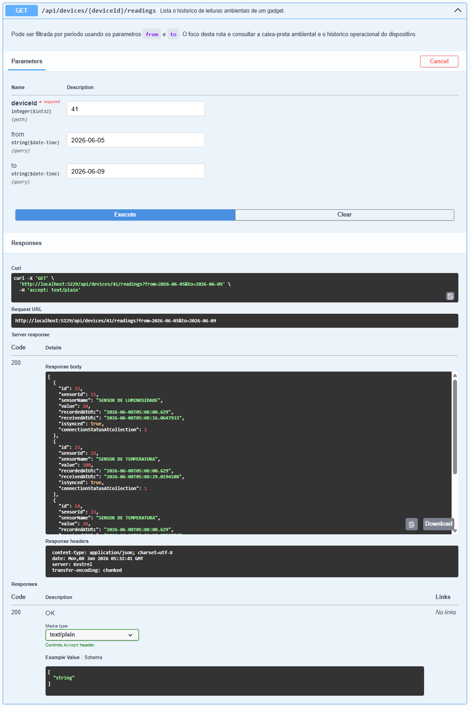

Response capturada (`response_get_api-devices-deviceid-readings.txt`):

```json
[
  {
    "id": 22,
    "sensorId": 21,
    "sensorName": "SENSOR DE LUMINOSIDADE",
    "value": 10,
    "recordedAtUtc": "2026-06-08T05:08:00.629",
    "receivedAtUtc": "2026-06-08T05:08:16.0647933",
    "isSynced": true,
    "connectionStatusAtCollection": 1
  },
  {
    "id": 23,
    "sensorId": 22,
    "sensorName": "SENSOR DE TEMPERATURA",
    "value": 100,
    "recordedAtUtc": "2026-06-08T05:08:00.629",
    "receivedAtUtc": "2026-06-08T05:08:29.0194108",
    "isSynced": true,
    "connectionStatusAtCollection": 1
  },
  {
    "id": 24,
    "sensorId": 23,
    "sensorName": "SENSOR DE TEMPERATURA",
    "value": 20,
    "recordedAtUtc": "2026-06-08T05:08:00.629",
    "receivedAtUtc": "2026-06-08T05:30:35.2525776",
    "isSynced": true,
    "connectionStatusAtCollection": 1
  },
  {
    "id": 21,
    "sensorId": 21,
    "sensorName": "SENSOR DE LUMINOSIDADE",
    "value": 10,
    "recordedAtUtc": "2026-06-08T04:54:13.511",
    "receivedAtUtc": "2026-06-08T04:54:28.4053569",
    "isSynced": true,
    "connectionStatusAtCollection": 1
  }
]
```

Contexto:

Este endpoint lista o histórico ambiental do gadget, com filtros opcionais por período.

O que a evidência comprova:

- Histórico temporal das leituras.
- Retorno de sensor, valor, horário de coleta, horário de recebimento e status de sincronização.
- Uso de `DateTime` para rastreabilidade.

Responses possíveis:

- `200 OK`: lista de leituras, podendo ser vazia.
- `404 Not Found`: dispositivo inexistente.
- `503 Service Unavailable`: falha de banco.

Variações conforme input/cenário:

- Sem filtros, retorna todo o histórico do device ordenado por `recordedAtUtc` decrescente.
- Com `from`, retorna apenas leituras a partir da data informada.
- Com `to`, retorna apenas leituras até a data informada.
- Com `from` e `to`, retorna somente leituras dentro da janela temporal.
- Se a janela não tiver leituras, retorna `[]`.
- Leituras offline aparecem com `isSynced: false` até passarem pelo endpoint de sync.

Tratamentos de erro:

- Validação da existência do dispositivo.
- Filtros `from` e `to` são convertidos para UTC quando informados.

### GET `/api/devices/{deviceId}/risk-assessment`

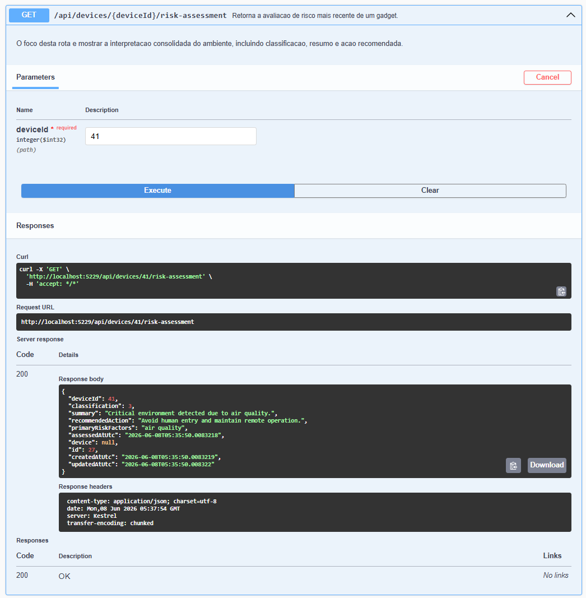

Response capturada (`response_get_api-devices-deviceid-risk-assessment.txt`):

```json
{
  "deviceId": 41,
  "classification": 3,
  "summary": "Critical environment detected due to air quality.",
  "recommendedAction": "Avoid human entry and maintain remote operation.",
  "primaryRiskFactors": "air quality",
  "assessedAtUtc": "2026-06-08T05:35:50.0083218",
  "device": null,
  "id": 27,
  "createdAtUtc": "2026-06-08T05:35:50.0083219",
  "updatedAtUtc": "2026-06-08T05:35:50.008322"
}
```

Contexto:

Este endpoint retorna a avaliação de risco mais recente do gadget.

O que a evidência comprova:

- Classificação de risco `Critical`.
- Resumo interpretável do ambiente.
- Ação recomendada para evitar entrada humana e manter operação remota.
- Uso do serviço `IRiskAssessmentService`.

Responses possíveis:

- `200 OK`: avaliação encontrada.
- `404 Not Found`: ainda não existe avaliação de risco para o dispositivo.
- `503 Service Unavailable`: falha de banco.

Variações conforme input/cenário:

- Se as últimas leituras estiverem dentro dos thresholds, `classification` será `1` e a ação recomendada será seguir monitorando.
- Se temperatura, umidade ou luminosidade estiverem fora do esperado, `classification` pode ser `2`.
- Se qualidade do ar ou vibração ultrapassarem threshold, `classification` tende a ser `3`.
- Se nenhuma leitura tiver sido registrada para o device, pode não existir avaliação e a API retorna `No risk assessment found for this device.`.

Tratamentos de erro:

- Retorno claro quando não há avaliação calculada.
- Cálculo separa risco crítico e atenção conforme thresholds.

### POST `/api/devices/{deviceId}/sync`

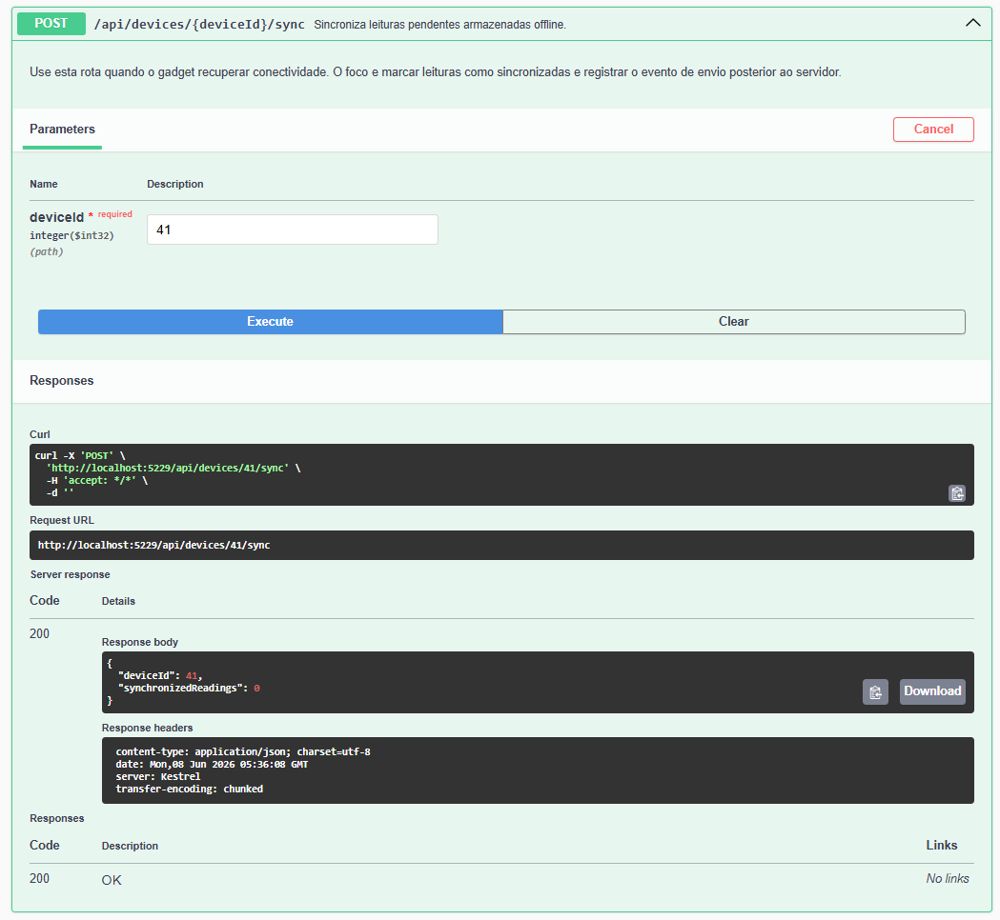

Response capturada (`response_post_api-devices-deviceid-sync.txt`):

```json
{
  "deviceId": 41,
  "synchronizedReadings": 0
}
```

Contexto:

Este endpoint sincroniza leituras pendentes coletadas offline.

O que a evidência comprova:

- Fluxo de sincronização operacional.
- Registro de log de sync mesmo quando não há leituras pendentes.
- Atualização do status de conexão do dispositivo para online.

Responses possíveis:

- `200 OK`: sincronização concluída, com quantidade de leituras sincronizadas.
- `404 Not Found`: dispositivo inexistente.
- `503 Service Unavailable`: falha de banco.

Variações conforme input/cenário:

- Se não houver leituras offline pendentes, o retorno será:

```json
{
  "deviceId": 41,
  "synchronizedReadings": 0
}
```

- Se forem registradas uma ou mais leituras com `connectionStatusAtCollection: 2` antes do sync, elas ficam com `isSynced: false`. Nesse caso, o sync retornará a quantidade sincronizada:

```json
{
  "deviceId": 41,
  "synchronizedReadings": 3
}
```

- Depois do sync, essas leituras passam para `isSynced: true`.
- O log criado muda conforme o cenário: sem pendências, `details` informa `No pending readings were found.`; com pendências, informa algo como `3 pending readings synchronized.`.
- Se o device não existir, a resposta será `Device not found.`.

Tratamentos de erro:

- Dispositivo inexistente é bloqueado.
- Logs registram o resultado da sincronização.

### GET `/api/devices/{deviceId}/sync-logs`

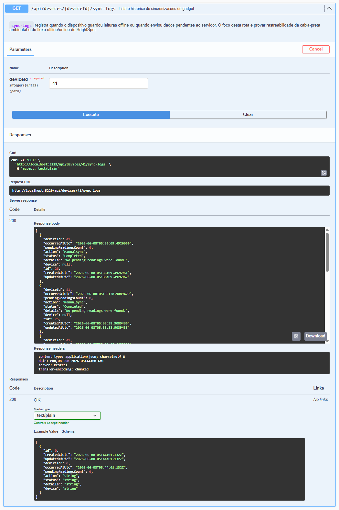

Response capturada (`response_get_api-devices-deviceid-synclogs.txt`):

```json
[
  {
    "deviceId": 41,
    "occurredAtUtc": "2026-06-08T05:36:09.4926956",
    "pendingReadingsCount": 0,
    "action": "ManualSync",
    "status": "Completed",
    "details": "No pending readings were found.",
    "device": null,
    "id": 26,
    "createdAtUtc": "2026-06-08T05:36:09.4926961",
    "updatedAtUtc": "2026-06-08T05:36:09.4926962"
  },
  {
    "deviceId": 41,
    "occurredAtUtc": "2026-06-08T05:35:38.9089429",
    "pendingReadingsCount": 0,
    "action": "ManualSync",
    "status": "Completed",
    "details": "No pending readings were found.",
    "device": null,
    "id": 25,
    "createdAtUtc": "2026-06-08T05:35:38.9089435",
    "updatedAtUtc": "2026-06-08T05:35:38.9089435"
  },
  {
    "deviceId": 41,
    "occurredAtUtc": "2026-06-08T05:34:40.6403029",
    "pendingReadingsCount": 0,
    "action": "ManualSync",
    "status": "Completed",
    "details": "No pending readings were found.",
    "device": null,
    "id": 24,
    "createdAtUtc": "2026-06-08T05:34:40.6403033",
    "updatedAtUtc": "2026-06-08T05:34:40.6403033"
  },
  {
    "deviceId": 41,
    "occurredAtUtc": "2026-06-08T05:11:47.939485",
    "pendingReadingsCount": 0,
    "action": "ManualSync",
    "status": "Completed",
    "details": "No pending readings were found.",
    "device": null,
    "id": 23,
    "createdAtUtc": "2026-06-08T05:11:47.9394857",
    "updatedAtUtc": "2026-06-08T05:11:47.9394858"
  },
  {
    "deviceId": 41,
    "occurredAtUtc": "2026-06-08T05:09:02.6131395",
    "pendingReadingsCount": 0,
    "action": "ManualSync",
    "status": "Completed",
    "details": "No pending readings were found.",
    "device": null,
    "id": 22,
    "createdAtUtc": "2026-06-08T05:09:02.6131403",
    "updatedAtUtc": "2026-06-08T05:09:02.6131404"
  },
  {
    "deviceId": 41,
    "occurredAtUtc": "2026-06-08T04:55:10.4353496",
    "pendingReadingsCount": 0,
    "action": "ManualSync",
    "status": "Completed",
    "details": "No pending readings were found.",
    "device": null,
    "id": 21,
    "createdAtUtc": "2026-06-08T04:55:10.435351",
    "updatedAtUtc": "2026-06-08T04:55:10.4353512"
  }
]
```

Contexto:

Este endpoint lista os eventos de sincronização registrados pelo gadget.

O que a evidência comprova:

- Rastreabilidade de eventos offline/online.
- Histórico com `OccurredAtUtc`, ação, status, quantidade pendente e detalhes.

Responses possíveis:

- `200 OK`: lista de logs, podendo ser vazia.
- `404 Not Found`: dispositivo inexistente.
- `503 Service Unavailable`: falha de banco.

Variações conforme input/cenário:

- Se nunca houve leitura offline nem sync manual, o retorno pode ser `[]`.
- Ao criar leitura offline, pode aparecer log com `action: "ReadingStoredOffline"` e `status: "PendingSync"`.
- Ao executar sync, aparece log com `action: "ManualSync"` e `status: "Completed"`.
- `pendingReadingsCount` será `0` quando não houver pendências, ou maior que `0` quando houver leituras offline registradas.

Tratamentos de erro:

- Validação da existência do dispositivo.
- Registro de log com mensagem legível.

### POST `/api/devices/{deviceId}/alerts`

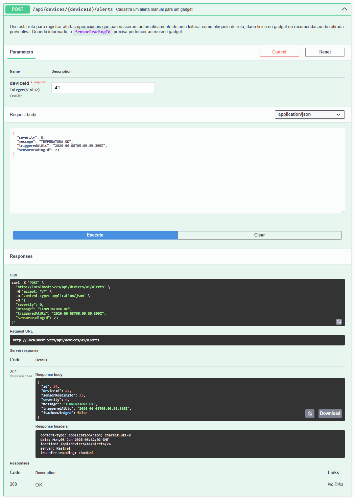

Response capturada (`response_post_api-devices-deviceid-alerts.txt`):

```json
{
  "id": 26,
  "deviceId": 41,
  "sensorReadingId": 23,
  "severity": 0,
  "message": "TEMPERATURA OK",
  "triggeredAtUtc": "2026-06-08T05:09:39.399Z",
  "isAcknowledged": false
}
```

Contexto:

Este endpoint cria um alerta manual, útil para registrar uma ocorrência operacional que não nasceu automaticamente de uma leitura.

O que a evidência comprova:

- Cadastro manual de alerta.
- Associação opcional com uma leitura existente.
- Persistência de mensagem operacional e data do evento.

Responses possíveis:

- `201 Created`: alerta cadastrado.
- `400 Bad Request`: mensagem vazia.
- `400 Bad Request`: `TriggeredAtUtc` no futuro.
- `400 Bad Request`: `SensorReadingId` não pertence ao dispositivo.
- `404 Not Found`: dispositivo inexistente.
- `503 Service Unavailable`: falha de banco.

Variações conforme input/cenário:

- Com `sensorReadingId: null`, o alerta é manual e não fica vinculado a uma leitura específica.
- Com `sensorReadingId` válido, o alerta fica associado à leitura informada.
- Se o `sensorReadingId` existir, mas pertencer a outro device, a resposta será `SensorReadingId does not belong to this device.`.
- Se `triggeredAtUtc` for omitido ou enviado como `null`, a API usa `DateTime.UtcNow`.
- Se `severity` for `1`, representa alerta informativo.
- Se `severity` for `2`, representa alerta de atenção.
- Se `severity` for `3`, representa alerta crítico.
- Se a mensagem for vazia ou só espaços, a resposta será `Alert message is required.`.

Tratamentos de erro:

- Validação de mensagem obrigatória.
- Validação de data futura.
- Validação de vínculo entre leitura e dispositivo.

Observação:

Em uma demonstração padronizada, recomenda-se usar `severity` com valores `1`, `2` ou `3`. O arquivo capturado mostra `severity: 0`, que não é ideal para representar a regra de severidade.

### GET `/api/devices/{deviceId}/alerts`

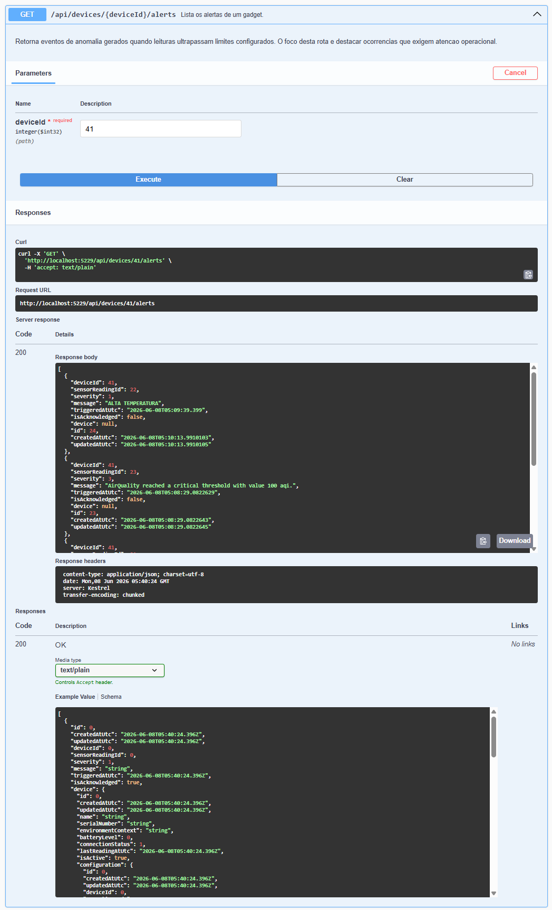

Response capturada (`response_get_api-devices-deviceid-alerts.txt`):

```json
[
  {
    "deviceId": 41,
    "sensorReadingId": 22,
    "severity": 1,
    "message": "ALTA TEMPERATURA",
    "triggeredAtUtc": "2026-06-08T05:09:39.399",
    "isAcknowledged": false,
    "device": null,
    "id": 24,
    "createdAtUtc": "2026-06-08T05:10:13.9910103",
    "updatedAtUtc": "2026-06-08T05:10:13.9910105"
  },
  {
    "deviceId": 41,
    "sensorReadingId": 23,
    "severity": 3,
    "message": "AirQuality reached a critical threshold with value 100 aqi.",
    "triggeredAtUtc": "2026-06-08T05:08:29.0822629",
    "isAcknowledged": false,
    "device": null,
    "id": 23,
    "createdAtUtc": "2026-06-08T05:08:29.0822643",
    "updatedAtUtc": "2026-06-08T05:08:29.0822645"
  },
  {
    "deviceId": 41,
    "sensorReadingId": 21,
    "severity": 1,
    "message": "ALTA TEMPERATURA",
    "triggeredAtUtc": "2026-06-08T04:55:45.133",
    "isAcknowledged": false,
    "device": null,
    "id": 22,
    "createdAtUtc": "2026-06-08T04:59:39.8492407",
    "updatedAtUtc": "2026-06-08T04:59:39.8492408"
  },
  {
    "deviceId": 41,
    "sensorReadingId": 21,
    "severity": 3,
    "message": "Vibration reached a critical threshold with value 10 mm/s.",
    "triggeredAtUtc": "2026-06-08T04:54:28.6100602",
    "isAcknowledged": false,
    "device": null,
    "id": 21,
    "createdAtUtc": "2026-06-08T04:54:28.6100628",
    "updatedAtUtc": "2026-06-08T04:54:28.6100629"
  }
][
  {
    "deviceId": 41,
    "sensorReadingId": 22,
    "severity": 1,
    "message": "ALTA TEMPERATURA",
    "triggeredAtUtc": "2026-06-08T05:09:39.399",
    "isAcknowledged": false,
    "device": null,
    "id": 24,
    "createdAtUtc": "2026-06-08T05:10:13.9910103",
    "updatedAtUtc": "2026-06-08T05:10:13.9910105"
  },
  {
    "deviceId": 41,
    "sensorReadingId": 23,
    "severity": 3,
    "message": "AirQuality reached a critical threshold with value 100 aqi.",
    "triggeredAtUtc": "2026-06-08T05:08:29.0822629",
    "isAcknowledged": false,
    "device": null,
    "id": 23,
    "createdAtUtc": "2026-06-08T05:08:29.0822643",
    "updatedAtUtc": "2026-06-08T05:08:29.0822645"
  },
  {
    "deviceId": 41,
    "sensorReadingId": 21,
    "severity": 1,
    "message": "ALTA TEMPERATURA",
    "triggeredAtUtc": "2026-06-08T04:55:45.133",
    "isAcknowledged": false,
    "device": null,
    "id": 22,
    "createdAtUtc": "2026-06-08T04:59:39.8492407",
    "updatedAtUtc": "2026-06-08T04:59:39.8492408"
  },
  {
    "deviceId": 41,
    "sensorReadingId": 21,
    "severity": 3,
    "message": "Vibration reached a critical threshold with value 10 mm/s.",
    "triggeredAtUtc": "2026-06-08T04:54:28.6100602",
    "isAcknowledged": false,
    "device": null,
    "id": 21,
    "createdAtUtc": "2026-06-08T04:54:28.6100628",
    "updatedAtUtc": "2026-06-08T04:54:28.6100629"
  }
]
```

Contexto:

Este endpoint lista os alertas do dispositivo, incluindo alertas automáticos e alertas manuais.

O que a evidência comprova:

- Histórico de alertas.
- Alertas automáticos por thresholds.
- Alertas manuais com mensagem operacional.
- Relacionamento opcional com `SensorReadingId`.

Responses possíveis:

- `200 OK`: lista de alertas, podendo ser vazia.
- `404 Not Found`: dispositivo inexistente.
- `503 Service Unavailable`: falha de banco.

Variações conforme input/cenário:

- Se não houver alertas para o device, o retorno será `[]`.
- Alertas automáticos aparecem quando leituras ultrapassam thresholds.
- Alertas manuais aparecem quando criados via `POST /api/devices/{deviceId}/alerts`.
- Após excluir um alerta, ele deixa de aparecer nessa listagem.
- A lista é ordenada pelos alertas mais recentes primeiro.

Tratamentos de erro:

- Validação da existência do dispositivo.
- Ordenação por data de acionamento mais recente.

Observação:

O arquivo `.txt` desta response está duplicado internamente. O print e o conteúdo seguem úteis, mas a versão final pode ser regenerada para ficar mais limpa.

### DELETE `/api/devices/{deviceId}/alerts/{alertId}`

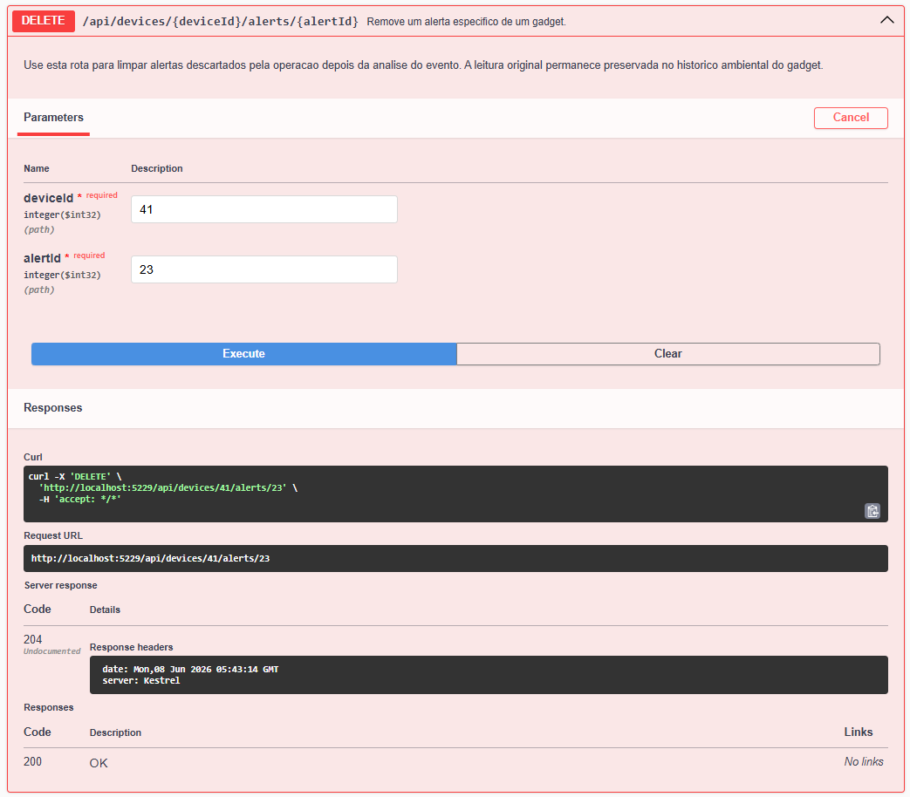

Contexto:

Este endpoint remove um alerta específico de um gadget sem apagar as leituras ambientais.

O que a evidência comprova:

- Exclusão controlada de alerta.
- Preservação do histórico de leituras.
- Validação do vínculo entre alerta e dispositivo.

Responses possíveis:

- `204 No Content`: alerta removido.
- `404 Not Found`: alerta inexistente ou alerta não pertence ao dispositivo.
- `503 Service Unavailable`: falha de banco.

Variações conforme input/cenário:

- Se `alertId` existir e pertencer ao device, a resposta não tem corpo e retorna `204 No Content`.
- Se o mesmo DELETE for executado duas vezes, a segunda chamada tende a retornar `404 Not Found`.
- Se o alerta existir em outro device, a resposta será `Alert not found for this device.`.
- Depois da remoção, `GET /api/devices/{deviceId}/alerts` não deve mais listar esse alerta.

Tratamentos de erro:

- O alerta só é removido se pertencer ao dispositivo informado.

### DELETE `/api/devices/{id}`

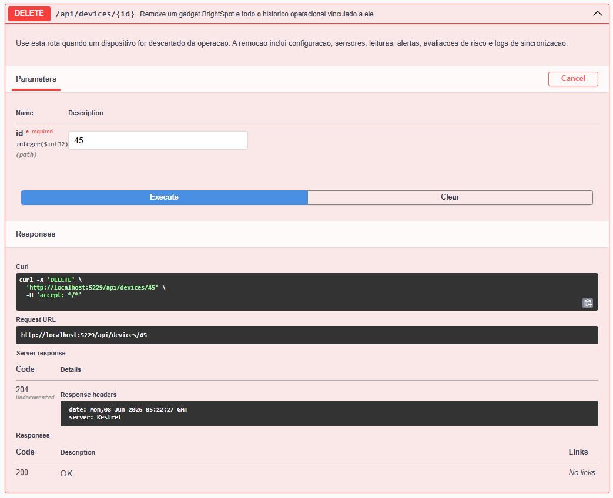

Contexto:

Este endpoint remove um gadget e o histórico operacional vinculado a ele.

O que a evidência comprova:

- Operação de exclusão de dispositivo.
- Remoção coordenada de alertas, avaliações de risco, logs, leituras, sensores e configuração.
- Fechamento do CRUD principal da entidade `Device`.

Responses possíveis:

- `204 No Content`: dispositivo removido.
- `404 Not Found`: dispositivo inexistente.
- `503 Service Unavailable`: falha de banco.

Variações conforme input/cenário:

- Se o device existir, a resposta é `204 No Content` e sem corpo.
- Após remover o device, `GET /api/devices/{id}` retorna `Device not found.`.
- Se o device tiver sensores, leituras, alertas, avaliações de risco e logs, a API remove esses vínculos antes de remover o device.
- Se houver nova tentativa de remover o mesmo device, a resposta será `404 Not Found`.

Tratamentos de erro:

- A API busca o dispositivo antes de remover dados vinculados.
- Dados dependentes são removidos em ordem controlada para evitar conflito de relacionamento.

## Cobertura das evidências

- API executando no terminal.
- Swagger aberto.
- Evidências de POST, GET, PATCH e DELETE.
- Evidências de banco e persistência.
- Evidências de domínio, sensores, leituras, risco, alertas e sincronização.
- Imagem de configuração Oracle com credenciais sensíveis ocultadas.
- Registro de responses reais e variações possíveis por cenário de uso.
