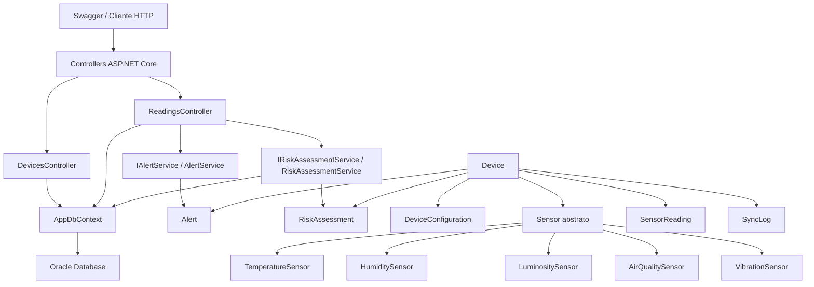
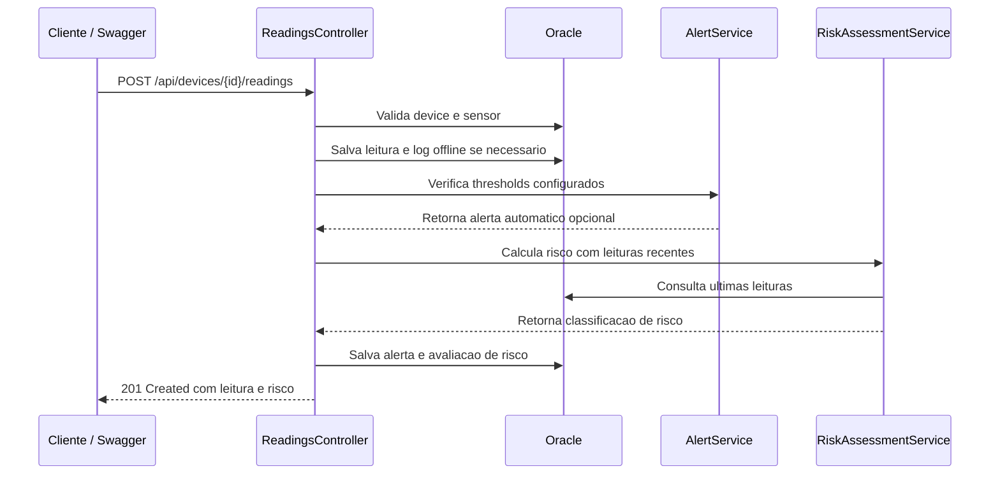

# Diagrama do projeto

O diagrama abaixo resume a arquitetura da API BrightSpot e o fluxo principal de dados.

```mermaid
flowchart TD
    Client["Swagger / Cliente HTTP"] --> Controllers["Controllers ASP.NET Core"]
    Controllers --> Devices["DevicesController"]
    Controllers --> Readings["ReadingsController"]

    Devices --> DbContext["AppDbContext"]
    Readings --> AlertService["IAlertService / AlertService"]
    Readings --> RiskService["IRiskAssessmentService / RiskAssessmentService"]
    Readings --> DbContext

    AlertService --> Alert["Alert"]
    RiskService --> Risk["RiskAssessment"]
    RiskService --> DbContext

    DbContext --> Oracle["Oracle Database"]

    Device["Device"] --> Configuration["DeviceConfiguration"]
    Device --> Sensor["Sensor abstrato"]
    Sensor --> Temperature["TemperatureSensor"]
    Sensor --> Humidity["HumiditySensor"]
    Sensor --> Luminosity["LuminositySensor"]
    Sensor --> AirQuality["AirQualitySensor"]
    Sensor --> Vibration["VibrationSensor"]
    Device --> Reading["SensorReading"]
    Device --> Alert
    Device --> Risk
    Device --> SyncLog["SyncLog"]
```

## Fluxo de leitura ambiental

```mermaid
sequenceDiagram
    participant Client as Cliente / Swagger
    participant API as ReadingsController
    participant DB as Oracle
    participant Alert as AlertService
    participant Risk as RiskAssessmentService

    Client->>API: POST /api/devices/{id}/readings
    API->>DB: Valida device e sensor
    API->>DB: Salva leitura e log offline se necessario
    API->>Alert: Verifica thresholds configurados
    Alert-->>API: Retorna alerta automatico opcional
    API->>Risk: Calcula risco com leituras recentes
    Risk->>DB: Consulta ultimas leituras
    Risk-->>API: Retorna classificacao de risco
    API->>DB: Salva alerta e avaliacao de risco
    API-->>Client: 201 Created com leitura e risco
```
